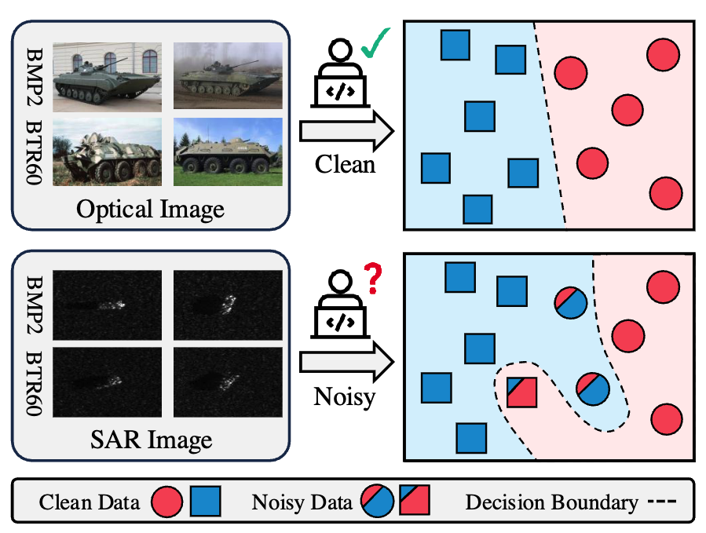
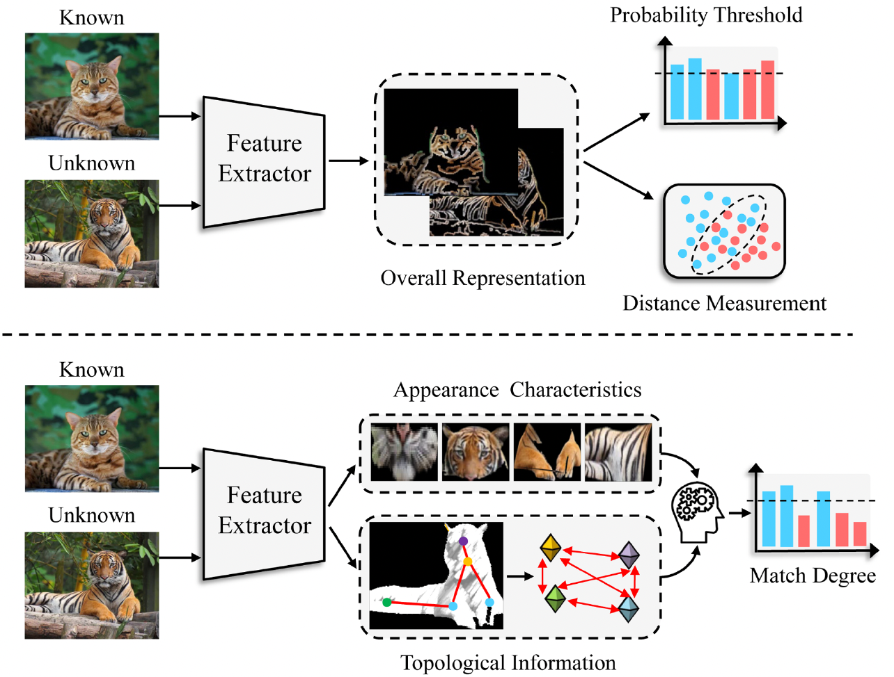
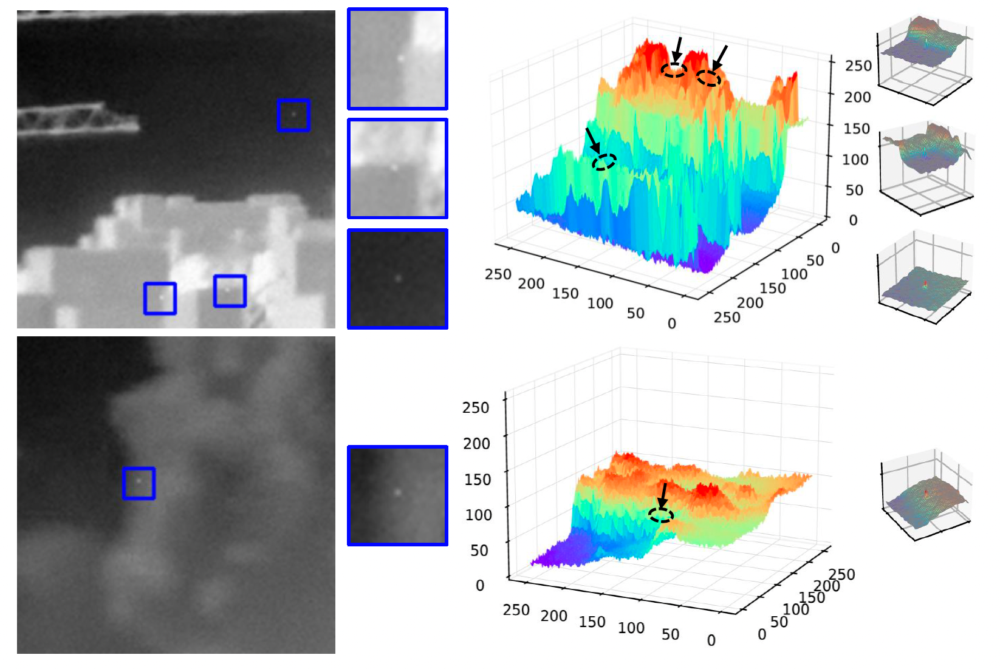
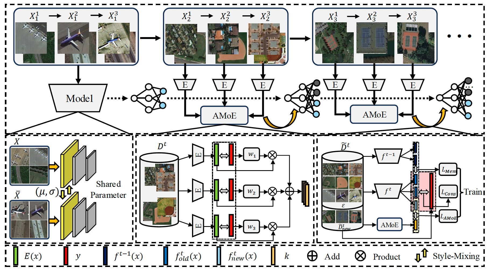
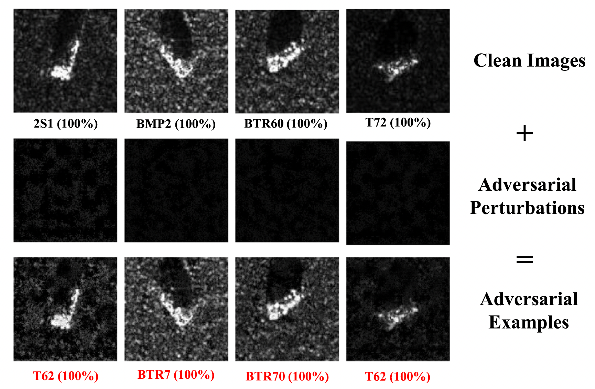
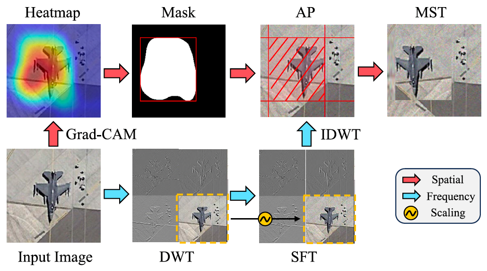
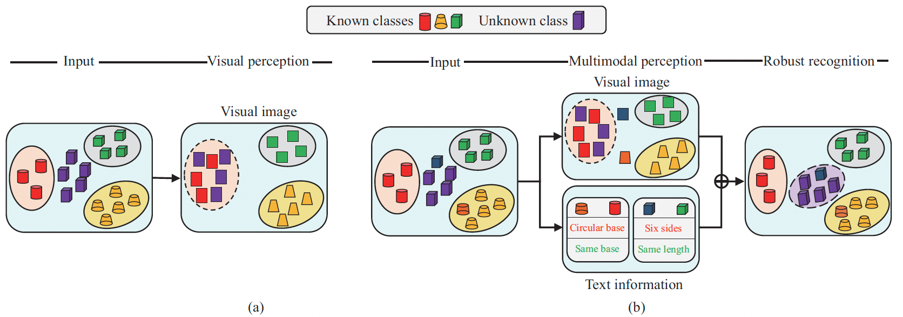
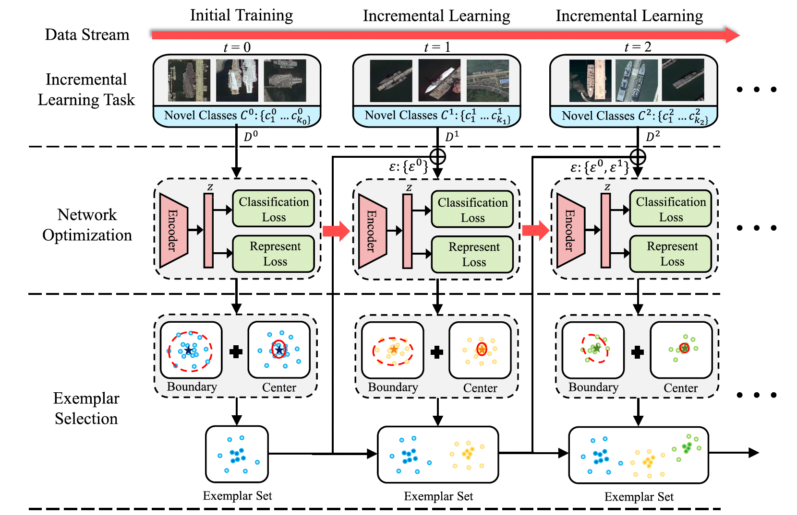
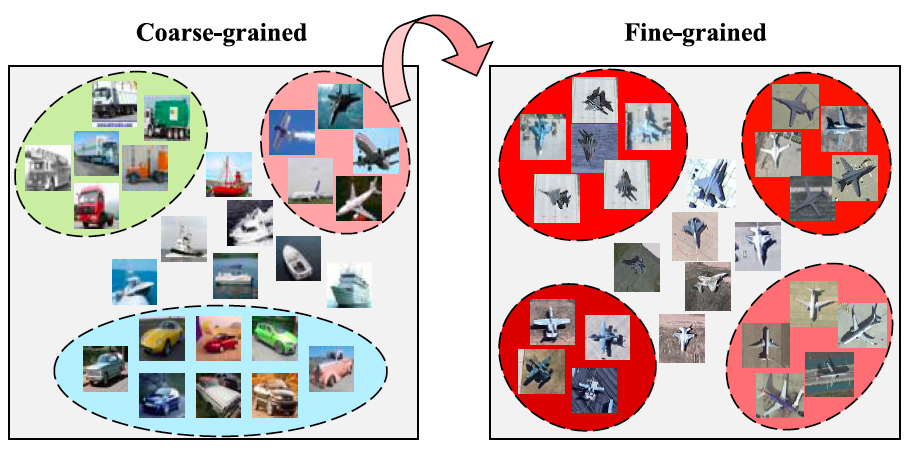
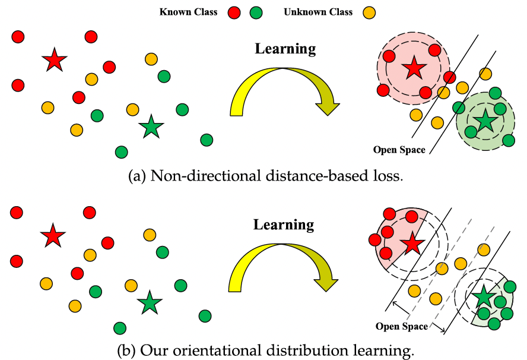








# 😁 About me
I obtained my Ph.D. degree from the School of Automation at Northwestern Polytechnical University (NWPU), under the supervision of **Prof. [Zhunga Liu](https://teacher.nwpu.edu.cn/liuzg.html)**.
My research interests focus on open-environment deep learning and its applications in remote sensing, including open set recognition, incremental learning, and adversarial learning.
Starting in 2025, I joined Hong Kong Baptist University (HKBU) as a postdoctoral researcher, supervised by **Prof. [Michael Kwok-Po Ng](https://sites.google.com/view/michael-ng-math/home)**.

# 🔥 News

- *2026.01*: &nbsp;🎉 One paper is accepted to IEEE T-RS.
- *2025.12*: &nbsp;🎉 Two papers are accepted to IEEE SPL.
- *2025.09*: &nbsp;🎉 One paper is accepted to IEEE T-GRS.
- *2025.09*: &nbsp;🎉 One paper is accepted to Signal Processing.
- *2025.08*: &nbsp;🎉 One paper is accepted to IEEE T-CSVT.
- *2025.07*: &nbsp;🎉 Two papers are accepted to ICCV and ACM MM 2025 workshops.
- *2025.03*: &nbsp;🎉 One paper is accepted to IEEE T-PAMI.
- *2025.02*: &nbsp;✈️ Onboarding at HKBU.
- *2024.12*: &nbsp;👨‍🎓 I obatain my Ph.D. degree from NWPU.
- *2024.11*: &nbsp;🎉 National Scholarship for PhD Students.
- *2024.08*: &nbsp;🎉 One paper is accepted to IEEE T-GRS.
- *2024.02*: &nbsp;🎉 One paper is accepted to IEEE T-AES.
- *2023.12*: &nbsp;🎉 One paper is accepted to SCIS.
- *2023.08*: &nbsp;🎉 One paper is accepted to IEEE T-GRS.
- *2023.03*: &nbsp;🎉 One paper is accepted to CVPR-W 2023.
- *2022.12*: &nbsp;🎉 One paper is accepted to IEEE T-PAMI.
- *2022.06*: &nbsp;🎉 One paper is accepted to PRCV 2022. (oral)

# 📝 Selected Publications 

TRS 2026

  
Collaborative Learning of Scattering and Deep Features for SAR Target Recognition with Noisy Labels. IEEE Transactions on Radar Systems, 2026. [[Paper](https://ieeexplore.ieee.org/document/11355694)] [[Code](https://github.com/fuyimin96/CLSDF)]

**Yimin Fu**, Zhunga Liu, Dongxiu Guo, Longfei Wang.

TPAMI 2025

  
Reason and Discovery: A New Paradigm for Open Set Recognition. IEEE Transactions on Pattern Analysis and Machine Intelligence, 2025. [[Paper](https://ieeexplore.ieee.org/abstract/document/10933572)] 

**Yimin Fu**, Zhunga Liu, Jialin Lyu.

TGRS 2025

  
A Unified SAM-Guided Self-Prompt Learning Framework for Infrared Small Target Detection. IEEE Transactions on Geoscience and Remote Sensing, 2025. [[Paper](https://ieeexplore.ieee.org/document/11172325)] [[Code](https://github.com/fuyimin96/SAM-SPL)]

**Yimin Fu**, Jialin Lyu, Peiyuan Ma, Zhunga Liu, Michael K. Ng.

TCSVT 2025

  
Adaptive Mixture-of-Experts Distillation for Cross-Satellite Generalizable Incremental Remote Sensing Scene Classification. IEEE Transactions on Circuits and Systems for Video Technology, 2025. [[Paper](https://ieeexplore.ieee.org/document/11124203)] [[Code](https://github.com/fuyimin96/AMoED)]

**Yimin Fu**, Runqing Yang, Zhunga Liu, Michael K. Ng.

SP 2025

  
Scattering-Guided Class-Irrelevant Filtering for Adversarially Robust SAR Automatic Target Recognition. Signal Processing, 2025. [[Paper](https://www.sciencedirect.com/science/article/pii/S0165168425003871)] [[Code](https://github.com/jialinlvcn/SGCIF-VAE)]

Zhunga Liu, Jialin Lyu, **Yimin Fu***.

TGRS 2024

  
Transferable Adversarial Attacks for Remote Sensing Object Recognition via Spatial-Frequency Co-Transformation. IEEE Transactions on Geoscience and Remote Sensing, 2024. [[Paper](https://ieeexplore.ieee.org/document/10636327)] [[Code](https://github.com/fuyimin96/SFCoT)]

**Yimin Fu**, Zhunga Liu, Jialin Lyu.

SCIS 2024

  
Logit Prototype Learning with Active Multimodal Representation for Robust Open-Set Recognition. Science China Information Sciences, 2024. [[Paper](https://link.springer.com/article/10.1007/s11432-023-3924-x)] [[Code](https://github.com/fuyimin96/LPL)]

**Yimin Fu**, Zhunga Liu, Zicheng Wang.

TAES 2024

  
Class-Incremental Recognition of Objects in Remote Sensing Images with Dynamic Hybrid Exemplar Selection. IEEE Transactions on Aerospace and Electronic Systems, 2024. [[Paper](https://ieeexplore.ieee.org/document/10423237)]

**Yimin Fu**, Zhunga Liu, Changyuan Wu, Feiyan Wu, Meiqin Liu.

TGRS 2023

  
Progressive Learning Vision Transformer for Open Set Recognition of Fine-Grained Objects in Remote Sensing Images. IEEE Transactions on Geoscience and Remote Sensing, 2023. [[Paper](https://ieeexplore.ieee.org/document/10231130)]

**Yimin Fu**, Zhunga Liu, Zuowei Zhang.

TPAMI 2022

  
Orientational Distribution Learning with Hierarchical Spatial Attention for Open Set Recognition. IEEE Transactions on Pattern Analysis and Machine Intelligence, 2022. [[Paper](https://ieeexplore.ieee.org/abstract/document/9978641)] [[Code](https://github.com/fuyimin96/ODL)]

Zhunga Liu, **Yimin Fu**, Quan Pan, Zuowei Zhang. (co-authored with PhD supervisor)

# 🎖 Honors and Awards
- *2024*: National Scholarship for PhD Students, NPU, Xi’an, China.
- *2023*: Innovation Foundation for Doctor Dissertation, NPU, Xi’an, China.
- *2023*: Cultivation Foundation for Excellent Doctoral Dissertation, NPU, Xi’an, China.
- *2023*: Outstanding Graduate Student, NPU, Xi’an, China.
- *2023*: The First Prize Scholarship, NPU, Xi’an, China.
- *2022*: The First Place in China University Basketball Association of Shaanxi Province, Xi’an, China.
- *2021 & 2022*: The Second Prize Scholarship for Two Times, NPU, Xi’an, China.

# 📖 Educations
- *2021.03 - 2024.12*, PhD, Northwestern Polytechnical University, School of Automation.
- *2018.09 - 2020.12*, Master, National Institute of Applied Science, Department of Electrical and Computer Engineering.
- *2015.09 - 2019.06*, Undergraduate, Northwestern Polytechnical University, School of Automation.

# 💻 Internships
- *2020.02 - 2020.7*, Tsinghua University, School of Vehicle and Mobility.
- *2019.06 - 2019.9*, China University of Petroleum (East China), College of Control Science and Engineering.
